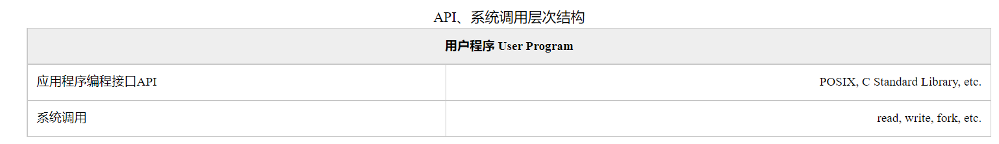
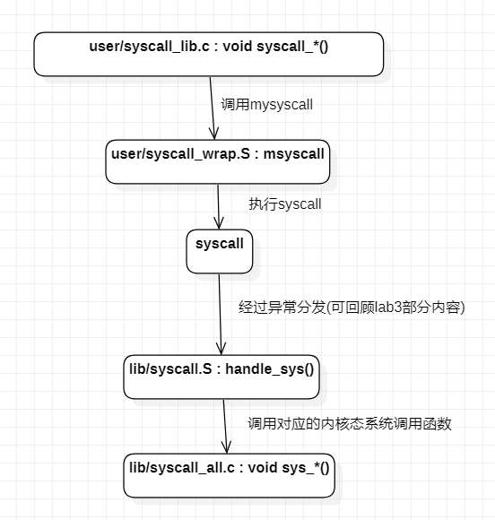
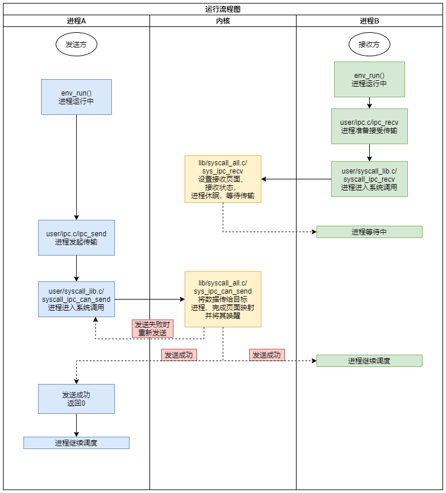

## 实验目的

1. 掌握系统调用的概念及流程
2. 实现进程间通讯机制
3. 实现 fork 函数
4. 掌握页写入异常的处理流程

## 系统和调用

系统调用的概念：

在用户态下，用户进程不能访问系统的内核空间，也就是说它不能存取内核使用的内存数据，也不能调用内核函数， 这一点是由CPU的硬件结构保证的。然而，用户进程在特定的场景下往往需要执行一些只能由内核完成的操作，如 操作硬件、动态分配内存，以及与其他进程进行通信等。允许在内核态执行用户程序提供的代码显然是不安全的，因此操作系统设计了一系列内核空间 中的函数，==当用户进程需要进行这些操作时，会引发特定的异常以陷入内核态，由内核调用对应的函数==，从而安全地为用户进程提供受限的系统级操作， 我们把这种机制称为**系统调用**。

在 lab4 中，我们需要实现上述的系统调用机制，并在此基础上实现**进程间通信**（IPC）机制和一个重要的进程创建机制 **fork**。 在fork部分的实验中，我们会介绍一种被称为**写时复制**（COW）的特性，以及与其相关的**页写入异常处理**。

1. **用户态和内核态**（也称用户模式和内核模式）： 

   它们是 CPU 运行的两种状态。根据 lab3 的说明，在 MOS 操作系统实验使用的仿真 R3000 CPU 中，该状态由 CP0 SR 寄存器中 KUc 位的值标志。

2. **用户空间和内核空间**

   它们是虚拟内存（进程的地址空间）中的两部分区域。根据 lab2 的说明，MOS 中的用户空间包括 kuseg， 而内核空间主要包括 kseg0 和 kseg1。每个进程的用户空间通常通过页表映射到不同的物理页，而内核空间则直接映射到固定的物理页[1](https://os.buaa.edu.cn/courses/course-v1:BUAA+B3I062270+2022_SPRING/courseware/e470f921cff34e418655f9480cabce6c/c4329e6bc82b4cbdb60b83647c8c5f86/?child=first#fn1)以及外部硬件设备。 CPU 在内核态下可以访问任何内存区域，对物理内存等硬件设备有完整的控制权，而在用户态下则只能访问用户空间。

3. **（用户）进程和内核**

   进程是资源分配与调度的基本单位，拥有独立的地址空间，而内核负责管理系统资源和调度进程，使进程能够并发运行。 与前两对概念不同，进程和内核并不是对立的存在，可以认为内核是存在于所有进程地址空间中的一段代码。


设置*`env_tf.cp0_status` 的值为 `0x1000100c`*


系统调用：于直接使用这些系统调用较为麻烦，于是产生了一系列用户空间的API定义，如POSIX 和C标准库等，它们在系统调用的基础上， 实现更多更高级的常用功能，使得用户在编写程序时不用再处理这些繁琐而复杂的底层操作， 而是直接通过调用高层次的API就能实现各种功能。通过这样巧妙的层次划分，使得程序更为灵活，也具有了更好的可移植性。 对于用户程序来说，只要自己所依赖的API不变，无论底层的系统调用如何变化，都不会对自己造成影响， 更易于在不同的系统间移植。整个结构如下表所示。



**系统调用机制的实现**：



`syscall_*`的函数的实现中，它们毫无例外都调用了msyscall函数，而且函数的第一个参数都是一个与调用名相似的宏（如`SYS_putchar`）， 在我们的MOS操作系统实验中把这个参数称为**系统调用号**（请在代码中找到这个宏的定义位置，了解系统调用号的排布规则）：

* **系统调用号查看**：./include/unistd.h:

```c
#ifndef UNISTD_H
#define UNISTD_H

#define __SYSCALL_BASE 9527
#define __NR_SYSCALLS 20


#define SYS_putchar 		((__SYSCALL_BASE ) + (0 ) ) 
#define SYS_getenvid 		((__SYSCALL_BASE ) + (1 ) )
#define SYS_yield			((__SYSCALL_BASE ) + (2 ) )
#define SYS_env_destroy		((__SYSCALL_BASE ) + (3 ) )
#define SYS_set_pgfault_handler	((__SYSCALL_BASE ) + (4 ) )
#define SYS_mem_alloc		((__SYSCALL_BASE ) + (5 ) )
#define SYS_mem_map			((__SYSCALL_BASE ) + (6 ) )
#define SYS_mem_unmap		((__SYSCALL_BASE ) + (7 ) )
#define SYS_env_alloc		((__SYSCALL_BASE ) + (8 ) )
#define SYS_set_env_status	((__SYSCALL_BASE ) + (9 ) )
#define SYS_set_trapframe		((__SYSCALL_BASE ) + (10 ) )
#define SYS_panic			((__SYSCALL_BASE ) + (11 ) )
#define SYS_ipc_can_send		((__SYSCALL_BASE ) + (12 ) )
#define SYS_ipc_recv		((__SYSCALL_BASE ) + (13 ) )
#define SYS_cgetc			((__SYSCALL_BASE ) + (14 ) )
#endif
```

### 练习题

> 由于网站中无法提交答案，因此在这里简记一下

对于系统调用syscall_cgetc，它传入msyscall函数的系统调用号的数字值应该是： 9527+14 = 9541

阅读代码，如果想要增加一个系统调用，下面这些文件需要被修改：

* lib/syscall.S（系统调用列表sys_call_table）、include/unistd.h（系统调用号相关）、lib/syscall_all.c（内核态系统调用函数）、user/syscall_lib.c（用户态系统调用函数syscall_*()）

在汇编宏CLI中，用到的STATUS_CU0的值是: 0x10000000(在`./include/asm/cp0regdef.h:41`处定义)

lib/syscall.S中最后一个TODO：/* TODO: 恢复栈指针到分配前的状态*/的正确代码是：`addiu sp, sp, 24`

用于从异常中返回（恢复现场）的ret_from_exception宏的定义在这个文件中：`/lib/genex.S:32`

```assembly
FEXPORT(ret_from_exception)
	.set noat
	.set noreorder
	RESTORE_SOME		/* 定义于./include/stackframe.h:90 */
	.set at
	lw	k0,TF_EPC(sp)	/* 取出用户态当前地址 */
	lw	sp,TF_REG29(sp) /* Deallocate stack */  
//1:	j	1b
	nop
	jr	k0								 
	rfe		
```

lib/syscall_all.c 中实现了一些系统调用，其中用于创建一个进程的是:`sys_env_alloc`

### 知识补充

#### 汇编指令

| 汇编码       | 含义                                        |
| ------------ | ------------------------------------------- |
| `mfc0 t, cs` | 把32位数据从协处理寄存器cs传送到通用寄存器t |
| `mtc0 s, cs` | 把32位数据从通用寄存器s传送到协处理寄存器cs |
|              |                                             |

回顾指令

| 汇编码          | 含义           |
| --------------- | -------------- |
| `sll d, s, shf` | `d = s << shf` |
|                 |                |

## 进程间通讯机制

|      字段       | 含义                                         |
| :-------------: | -------------------------------------------- |
|  env_ipc_value  | 进程传递的具体数值                           |
|  env_ipc_from   | 发送方的进程ID                               |
| env_ipc_recving | 1：等待接受数据中；0：不可接受数据           |
|  env_ipc_dstva  | 接收到的页面需要与自身的哪个虚拟页面完成映射 |
|  env_ipc_perm   | 传递的页面的权限位设置                       |



### 练习题

> 由于网站中无法提交答案，因此在这里简记一下

进程控制块中用于表示进程是否处于接收状态的域是env_ipc_recving，（例如，env_ipc_value）如果处于接受状态，这个域的值是1

系统调用sys_ipc_recv中放弃CPU时，需要调用相关函数重新进行调度，请问这个相关函数是`sys_yield`

## Fork


## 写入异常的处理流程


## Thinking

**Thinking 4.1**. 思考并回答下面的问题：

- 内核在保存现场的时候是如何避免破坏通用寄存器的？

使用SAVE_ALL函数用于保存所有寄存器、使用CLI函数用于屏蔽中断位的设置

- 系统陷入内核调用后可以直接从当时的\$a0-\$a3参数寄存器中得到用户调用msyscall留下的信息吗？

> 需要注意的是，陷入内核态的操作并不是从一个函数跳转到了另一个函数，此处的指针 $sp 是内核空间的栈指针，系统从用户态切换到内核态后，内核首先需要将原用户进程的运行现场保存到内核空间（其保存的结构与结构体**struct** **Trapframe**等同，请寻找完成这部分功能的代码实现），栈指针指向这个结构体的起始位置，因此我们正是借助这个保存的结构体来获取用户态中传递过来的值（例如：用户态下 \$a0 寄存器的值保存在了当前栈下的 TF_REG4(sp)处）。																																																							——lab4指导书

正如指导书中所说，陷入内核态的操作并不是从一个函数跳转到了另一个函数，故不能简单的从参数寄存器中获得值。

- 我们是怎么做到让sys开头的函数“认为”我们提供了和用户调用msyscall时同样的参数的？

从具体实现上讲，我们将内核空间中用于传参的寄存器中的值设置为了与msyscall中相同的状态，且栈帧顶的24Byte空间也设置成了与msyscall中相同的状态。

- 内核处理系统调用的过程对Trapframe做了哪些更改？这种修改对应的用户态的变化是？

按照cause寄存器的BD字段更新了TF_EPC，对应用户态返回的指令地址的变化

为TF_REG2(sp) 赋值，对应用户态设置了函数的返回值

**Thinking 4.2**. 思考下面的问题，并对这个问题谈谈你的理解： 请回顾 lib/env.c 文件中 `mkenvid()` 函数的实现，该函数不会返回 0，请结合系统调用和 IPC 部分的实现 与 `envid2env()` 函数的行为进行解释。

